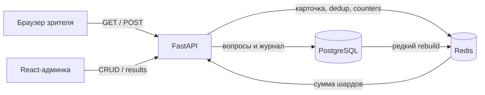

# Архитектура и логика

## Контур системы

У сервиса два разных профиля нагрузки:

- административный CRUD — единицы запросов, источник данных PostgreSQL;
- голосование во время эфира — короткий пик на один `question_id`, горячий
  путь проходит через Redis.

100 млн голосов за минуту соответствуют примерно 1,7 млн RPS. Один локальный
контур не заявляет такую производительность, но не содержит операций
PostgreSQL в критической части принятия решения и результата.



Frontend production-сборки отдаёт Nginx. Он проксирует API, поэтому cookie
зрителя остаётся same-site. Локальный Compose содержит `frontend`, `api`,
`postgres` и `redis`.

## Модель данных

### `question`

Хранит текст, сохранённый статус, `show_time`, `duration_seconds` и время
создания/изменения. Статусы `scheduled`, `live` и `closed` не записываются:
они вычисляются из серверного времени.

### `question_option`

Хранит динамические варианты ответа. `(question_id, key)` уникален,
`position` определяет порядок кнопок.

### `vote`

Append-only журнал:

- `question_id`;
- `option_key`;
- `dedup_key = sha256(question_id | vid)`;
- `ip_hash = sha256(ip | salt)`;
- `voted_at`.

Уникальность `(question_id, dedup_key)` служит вторым барьером повторов.
Таблица разделена на 16 hash-партиций по `question_id`, индекс результатов —
`(question_id, option_key)`.

### `question_result`

Снимок восстановленного результата: `(question_id, option_key, count,
rebuilt_at)`. Он используется после пересчёта журнала и не заменяет live
счётчики.

## Чтение публичной формы

1. API получает карточку вопроса из Redis; при промахе читает PostgreSQL и
   прогревает кэш.
2. Проверяет сохранённый статус и временное окно.
3. Выдаёт cookie `vid`, если её ещё нет.
4. Проверяет наличие дедуп-ключа.
5. Возвращает только `id`, `name`, `closes_at` и варианты.

Изменение вопроса обновляет его Redis-кэш. Варианты после первого голоса
заблокированы, поэтому карточка и счётчики не расходятся.

## Атомарное принятие голоса

До записи Redis выполняются проверки публикации, окна и варианта. Затем один
Lua-скрипт:

1. проверяет отсутствие дедуп-ключа;
2. проверяет тип ключа счётчика;
3. создаёт дедуп-ключ с TTL;
4. выполняет `HINCRBY` выбранного варианта;
5. возвращает `accepted` либо `already_voted`.

`SET NX` и `HINCRBY` не разделены сетевым вызовом: процесс не может упасть
между резервированием зрителя и увеличением результата. Если ответ Redis
потерян в сети, повтор безопасно вернёт `already_voted`.

Шард выбирается детерминированно:

```text
dedup_key = sha256(question_id | vid)
shard = crc32(dedup_key) % COUNTER_SHARDS
counter = results:{question_id}:{shard}
```

После Redis событие попадает в журнал. При `VOTE_ASYNC=false` запись
выполняется сразу. При `VOTE_ASYNC=true` текущая реализация использует
ограниченную очередь процесса и batch insert до 1000 событий или 50 мс.
Счётчик Redis остаётся оперативным итогом.

Внутрипроцессная очередь не является durable и может потерять ещё не
записанный batch при аварии. Замена на Redis Streams и reconciliation —
первый пункт [production-roadmap](05-production-roadmap.md).

## Дедупликация и приватность

Cookie `vid` — идентификатор браузера, а не пользователя. IP намеренно не
входит в уникальность: иначе зрители за одним NAT получили бы один голос.

TTL дедупа равен оставшемуся времени окна плюс сутки. Проверка окна идёт до
Lua-скрипта, поэтому слишком ранний или поздний запрос не занимает дедуп-ключ.

Новый браузер или очищенная cookie обходят защиту. Это соответствует
требованию базовой дедупликации и не позиционируется как антибот-система.
Наружу не возвращаются `vid`, `dedup_key` и `ip_hash`.

## Результаты

Административный запрос читает все `results:{question_id}:{shard}`, складывает
значения и присоединяет подписи вариантов. Число операций зависит от
`COUNTER_SHARDS`, а не от количества голосов.

Если Redis-счётчиков нет, закрытый вопрос пересчитывается:

```sql
SELECT option_key, count(*)
FROM vote
WHERE question_id = :question_id
GROUP BY option_key;
```

Полученный снимок записывается в `question_result` и обратно в Redis.
Принудительный rebuild доступен отдельным административным endpoint. Во время
live-окна автоматический тяжёлый `GROUP BY` не запускается.

## Согласованность и отказы

- Redis недоступен — публичный голос получает `503`; fallback на одиночные
  INSERT в PostgreSQL запрещён, потому что нарушит общий дедуп.
- PostgreSQL недоступен, Redis доступен — оперативный счётчик может принять
  голос; надёжность журнала зависит от выбранного режима записи.
- API не хранит пользовательского состояния, поэтому несколько реплик могут
  использовать общий Redis.
- Уникальность журнала делает повторный batch insert идемпотентным.
- Удаление Redis после закрытия исправляется rebuild из журнала.

## Масштабирование

Один Redis-ключ ограничен одним execution thread, поэтому счётчики
шардируются. При переходе к Redis Cluster dedup, counter и durable stream
одной операции должны использовать совместимый hash tag.

Оценка для 100 млн дедуп-ключей — примерно 8–16 ГБ с учётом overhead.
Журнал с индексами — десятки гигабайт на эфир. Точные числа должны
подтверждаться k6-тестом, метриками и capacity plan, а не линейной
экстраполяцией ноутбука.

Публичные API-реплики, административные реплики, Redis Cluster и consumer
журнала масштабируются независимо. Детали ещё не реализованного
production-контура находятся в [roadmap](05-production-roadmap.md).
