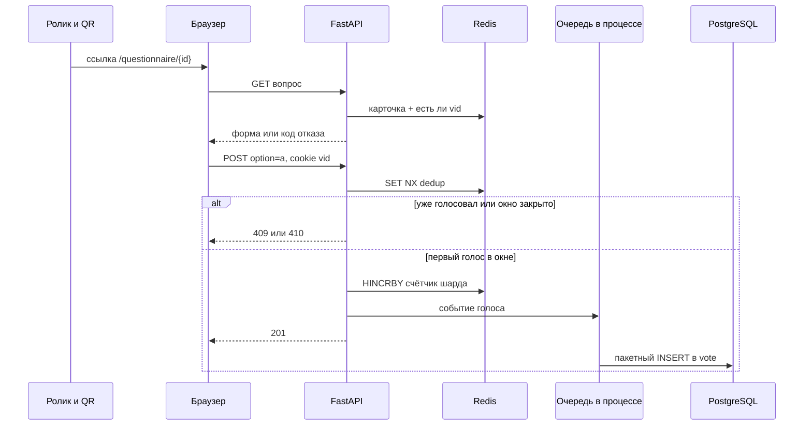

# Архитектура

## 1. Почему такой контур

У системы два режима, и они не похожи по нагрузке.

**Админка** — единицы запросов в минуту. Обычный CRUD в PostgreSQL.

**Минута эфира** — один URL, один `question_id`, почти все зрители страны. 100 млн голосов за 60 секунд ≈ **1,7 млн запросов в секунду** в пике, если явка близка к 100%. Даже если реально проголосует 10%, это сотни тысяч RPS на один ключ. Это и есть «вопрос про скорость» при 10 млн строк.

Отсюда правило горячего пути:

1. Не читать PostgreSQL, чтобы понять, можно ли голосовать. Карточка вопроса на время эфира лежит в Redis.
2. Не делать `INSERT` синхронно в том же запросе, который должен ответить зрителю на таком RPS. В тестовом insert можно оставить синхронным на малых объёмах, но граница «здесь будет очередь» должна быть в коде.
3. Не считать итог запросом `SELECT option_key, count(*) FROM vote GROUP BY 1` при открытии дашборда.



Админ в это же время читает `GET /questions/{id}/results`: API складывает шарды Redis и отдаёт суммы. PostgreSQL на этом запросе не участвует, пока счётчики живы.

## 2. Выбор технологий

Стек компании: Go, Python, React, PostgreSQL, Redis, Elasticsearch, Kubernetes. Реализация тестового — Python и React. Фреймворки, версии семейств и отказы (Django, Flask, Next.js, Elasticsearch) собраны в [стеке](06-stack.md).

| Компонент | Роль | Почему |
| --- | --- | --- |
| **Python, FastAPI** | HTTP API | Тот же горячий путь: распарсить JSON, сходить в Redis, ответить. Узкое место не в языке, а в Redis и в журнале. Async-обработчик это выражает напрямую |
| **PostgreSQL** | Вопросы, варианты, журнал `vote`, снимок итога | Источник правды для админки и возможность пересчитать счётчики. Партиции по вопросу |
| **Redis** | Дедуп, счётчики, кэш карточки вопроса | Атомарный `SET NX` и `HINCRBY`. Память на минуту эфира предсказуема |
| **React** | Форма зрителя и таблица админки | Второй этап, после стабильного API. См. план фронта |
| Elasticsearch | не используем | Агрегаты по 2–10 ключам не поиск. Лишний кластер на собеседовании выглядит как стек «на всякий случай» |
| Kubernetes | целевой деплой, не локальный запуск | Локально Docker Compose. В проде API без состояния, Redis Cluster, Postgres с партициями |

Локальный минимум: один процесс API, один Postgres, один Redis. Шарды счётчиков в коде есть уже сейчас, их число задаётся `COUNTER_SHARDS` (локально `1`, в рассказе про прод — `64` и выше).

## 3. Модель данных

Три таблицы плюс снимок. Колонки `a/b/c/d` не заводим.

### question

| Колонка | Смысл |
| --- | --- |
| `id` | `bigserial`, им пользуются админ и ссылка |
| `name` | текст вопроса |
| `status` | `draft` \| `published` \| `cancelled` |
| `show_time` | `timestamptz`, старт приёма голосов |
| `duration_seconds` | по умолчанию 60 |
| `created_at`, `updated_at` | аудит админки |

Эффективный статус (не колонка):

- `draft` / `cancelled` — как в `status`;
- `published` и `now < show_time` → `scheduled`;
- `published` и `show_time <= now < show_time + duration` → `live`;
- `published` и `now >= конец` → `closed`.

Интервал полуоткрытый: в саму миллисекунду конца голос уже не принимается.

### question_option

| Колонка | Смысл |
| --- | --- |
| `id` | `bigserial` |
| `question_id` | FK |
| `key` | короткий код, его шлёт клиент (`a`, `b`, `yes`) |
| `label` | текст на кнопке |
| `position` | порядок на форме |

Уникальность `(question_id, key)`.

### vote

Журнал, только вставка.

| Колонка | Смысл |
| --- | --- |
| `id` | `bigserial` |
| `question_id` | FK, ключ партиции |
| `option_key` | что выбрали |
| `dedup_key` | `hex(sha256(question_id \|\| cookie vid))`, 64 символа |
| `ip_hash` | `hex(sha256(ip \|\| salt))`, соль в env |
| `voted_at` | время сервера |

Уникальный индекс `(question_id, dedup_key)` — второй замок, если Redis забыл ключ, а запись в журнал уже была. На полном объёме 100 млн этот индекс тяжёлый; для тестового он правильный. В проде при нехватке диска журнал можно сэмплировать, счётчики остаются полными — это осознанный компромисс, в тестовом пишем каждый голос.

Партиция: `PARTITION BY LIST (question_id)` или, проще в миграциях, отдельная партиция на вопрос создаётся в момент перевода в `published`. Для первой версии допустима одна таблица и индекс `(question_id, option_key)` — пока нет десятка миллионов локально. В плане реализации партиция стоит отдельным шагом до разговора про нагрузку, не обязательно до первых curl.

### question_result

Снимок после закрытия окна или после пересчёта.

| Колонка | Смысл |
| --- | --- |
| `question_id`, `option_key` | PK |
| `count` | сумма |
| `rebuilt_at` | когда посчитали |

## 4. Дедупликация

Условие: защита от обычного зрителя, не от инженера с ботом.

**Ключ уникальности — cookie `vid`.** Сервер ставит `Set-Cookie: vid=<uuid>; Path=/; Max-Age=86400; SameSite=Lax; HttpOnly`. Один браузер, один вопрос, один голос. Повторная отправка формы, обновление страницы, второй клик — `409`.

**IP не входит в ключ уникальности.** Иначе семья за домашним NAT или толпа за адресом оператора получит один голос на всех. IP сохраняем только как хеш в журнале: по нему видно грубую картину, в API он не светится.

Обходы, которые принимаем молча: новое окно инкогнито, другой браузер, очистка cookie. Это прямо следует из формулировки «не слишком защищённую от обхода».

Гонка двух запросов с одним cookie закрывается `SET key NX EX ttl`. Успел один клиент Redis — второй видит ключ и не инкрементирует. TTL дедуп-ключа = время до конца окна + запас (например сутки), чтобы повтор после эфира тоже получал `already_voted`, а не «окно закрыто» вперемешку. Порядок проверок на `POST`:

1. Вопрос опубликован, иначе `not_published` / `not_found`.
2. `now` внутри окна, иначе `window_not_started` или `window_closed`.
3. Вариант существует, иначе `422 invalid_option`.
4. `SET NX`. Если не установился — `409`.
5. Инкремент счётчика и постановка события в журнал.

Проверка окна стоит до `SET NX`, чтобы голос в закрытое окно не занимал слот навсегда. Если окно ещё не началось, ключ дедупа не ставим.

## 5. Счётчики и 10 млн строк

На каждый принятый голос:

```text
shard = crc32(dedup_key) % COUNTER_SHARDS
HINCRBY results:{questionId}:{shard}  {optionKey}  1
```

Почему шард. Все зрители бьют в один `question_id`. Один ключ Redis обслуживается одним потоком. `HINCRBY` одного ключа — это сотни тысяч операций в секунду, не 1,7 млн. Шарды размазывают запись. Чтение результата — `COUNTER_SHARDS` команд `HGETALL` и сумма в процессе API. Для одного вопроса это дешёво: вариантов мало, шардов десятки.

Оценка памяти дедупа на 100 млн уникальных cookie: порядок 50–100 байт на ключ с запасом на аллокатор → примерно **8–16 ГБ** Redis на один ролик. Для тестового это аргумент в документации, не требование к ноутбуку. Локально ключей мало, TTL их подчистит.

Оценка журнала: ~100 байт на строку полезной нагрузки, с индексом уникальности грубо **15–30 ГБ на 100 млн**. Вставка пачками по 500–2000 строк (`COPY` или multi-value `INSERT`) с воркера, который читает канал в процессе. Если канал переполнен, запрос зрителя всё равно уже ответил `201`: счётчик источник оперативного итога, журнал догоняет. Потеря канала при падении процесса лечится тем, что дедуп-ключ в Redis есть, а строки нет — расхождение чинится только в сторону «счётчик ≥ журнал». Для тестового достаточно синхронной вставки и комментария на месте, где канал включается флагом `VOTE_ASYNC=true`. Имеет смысл включить флаг в реализации, даже если буфер маленький: на защите будет что показать.

Пересчёт, если Redis пуст:

```sql
SELECT option_key, count(*)
FROM vote
WHERE question_id = $1
GROUP BY option_key;
```

Этот запрос административный и редкий. На 10 млн строк с индексом по `(question_id, option_key)` он занимает секунды, не миллисекунды. Поэтому он не стоит на пути дашборда во время эфира. Результат пересчёта пишется в `question_result` и в Redis, дальше снова читаются счётчики.

Пока окно открыто, фоновый пересчёт не запускаем: он спорит с потоком вставок.

## 6. Кэш карточки вопроса

На `published` API кладёт в Redis JSON: имя, варианты, `show_time`, `duration`, `status`. `GET` формы читает его. `PUT`/`DELETE` инвалидируют ключ. Так горячий `GET` (QR открывают чаще, чем голосуют) не кладёт Postgres.

Локально промах кэша читает Postgres и заполняет ключ. Несогласованность окна не страшна дольше пары секунд: источник окна — этот JSON, а `PUT` во время `live` для вариантов всё равно запрещён.

## 7. Отказы, о которых стоит сказать на защите

- Redis недоступен в минуту эфира: голосование останавливаем (`503`), а не пишем в Postgres по одному запросу. Иначе дедуп разъедется.
- Postgres недоступен, Redis жив: зрителям отвечаем `201`, журнал копится в канале ограниченно, при переполнении считаем голоса только в Redis и помечаем метрикой `journal_dropped`. Для тестового достаточно лога.
- Два инстанса API: состояния в них нет, дедуп общий в Redis. Это причина, почему отметка «уже голосовал» не лежит в памяти процесса.

## 8. Как это связано с вакансией

Горячий путь здесь устроен так же, как маршрутизация платежа: быстрое решение на кэше и атомарном ключе, журнал и сверка отдельно, идемпотентность обязательна, сырые персональные данные в ответ не попадают. На защите это можно сказать одной фразой, не раздувая тестовое до платёжного шлюза.
