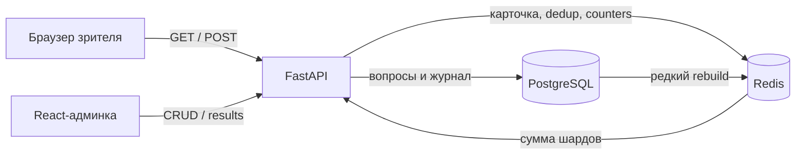

# Архитектура

У сервиса два профиля нагрузки. Админка — единицы запросов, источник
PostgreSQL. Голосование в минуту эфира — короткий пик на один `question_id`,
решение принимается в Redis.

100 млн голосов за минуту — около 1,7 млн RPS, если явка близка к 100%.
Локальный контур такую скорость не заявляет. В критической части принятия
голоса и живого итога нет операций PostgreSQL. Разбор по коду —
в [нагрузке](08-load.md).


```mermaid
flowchart LR
    Viewer[Браузер зрителя] -->|GET / POST| API[FastAPI]
    Admin[React-админка] -->|CRUD / results| API
    API -->|карточка, dedup, counters| Redis[(Redis)]
    API -->|вопросы и журнал| PG[(PostgreSQL)]
    Redis -->|сумма шардов| API
    PG -->|редкий rebuild| Redis
```

Production-сборку frontend отдаёт Nginx. Он же проксирует API, поэтому
cookie `vid` остаётся same-site. Локальный Compose поднимает `frontend`,
`api`, `postgres` и `redis`.

## Данные

`question` хранит текст, сохранённый статус, `show_time`, `duration_seconds`
и время создания. `scheduled`, `live` и `closed` вычисляет
`effective_status()` по серверным часам. Границу окна считает
`question/voting_window.py`: конец интервала не входит в окно.

`question_option` хранит варианты. Пара `(question_id, key)` уникальна,
`position` задаёт порядок кнопок.

`vote` — append-only журнал: `question_id`, `option_key`,
`dedup_key = sha256(question_id|vid)`, `ip_hash = sha256(ip|salt)`,
`voted_at`. Уникальность `(question_id, dedup_key)` — второй барьер повтора.
Таблица разрезана на 16 hash-партиций по `question_id`. Индекс результатов —
`(question_id, option_key)`. В минуту ролика вопрос один, поэтому строки
этого эфира попадают в одну партицию. Партиции отделяют вопросы друг от
друга, а не размазывают запись одного эфира.

`question_result` — снимок после пересчёта: `(question_id, option_key, count,
rebuilt_at)`. Он не заменяет живые счётчики.

## Карточка вопроса

Ключ `question:{id}` лежит в Redis без TTL. Создание и правка перезаписывают
его после commit PostgreSQL, удаление стирает ключ. Публичный запрос читает
кэш; промах читает PostgreSQL и прогревает Redis. Варианты после первого
голоса заблокированы, поэтому карточка и счётчики не расходятся из-за смены
кнопок.

## Приём голоса

До записи Redis проверяются публикация, окно и ключ варианта. Слишком ранний
и слишком поздний запрос Redis не меняют. Затем один Lua-скрипт в
`vote/atomic_counter.py`:

1. если дедуп-ключ уже есть, возвращает `already_voted` и ничего не пишет;
2. проверяет, что ключ счётчика отсутствует или является hash;
3. ставит дедуп с TTL;
4. делает `HINCRBY` выбранного варианта.

`SET` и `HINCRBY` не разделены сетевым вызовом. Если ответ Redis потерялся,
повтор того же `vid` вернёт `already_voted`, а счётчик увеличен один раз.

Шард выбирается детерминированно:

```text
dedup_key = sha256(question_id | vid)
shard = crc32(dedup_key) % COUNTER_SHARDS
counter = results:{question_id}:{shard}
dedup = vote:{question_id}:{dedup_key}
```

TTL дедупа — остаток окна плюс сутки. IP в формулу не входит.

После Redis событие попадает в журнал. При `VOTE_ASYNC=false` строка
пишется сразу. При `VOTE_ASYNC=true` она встаёт в очередь процесса: пачка
до 1000 событий или 50 мс, очередь ограничена 10 000. Повторная вставка той
же пары `(question_id, dedup_key)` идемпотентна. Счётчик Redis при этом уже
увеличен. Ошибка журнала не откатывает его и не меняет ответ `201`. Очередь
не переживает падение процесса. Вынос её в Redis Stream — первый пункт
[roadmap](05-production-roadmap.md).

## Результат

`GET /questions/{id}/results` читает все шарды одним pipeline `HGETALL` через
`store/counter_shards.py` и складывает поля в процессе API. Число операций
зависит от `COUNTER_SHARDS`, не от числа голосов. Тот же читатель отвечает
на вопрос «есть ли голоса» при правке и удалении: положительное значение в
любом шарде или строка в `vote`.

Если ни один шард не содержит полей и вопрос не `live`, запускается
пересчёт:

```sql
SELECT option_key, count(*)
FROM vote
WHERE question_id = :question_id
GROUP BY option_key;
```

Снимок пишется в `question_result`, старые ключи шардов удаляются, числа
кладутся в шард `0`. Принудительный пересчёт — `POST /questions/{id}/results/rebuild`.
В интерфейсе кнопки нет. Пока вопрос `live`, пустой Redis остаётся нулями:
дашборд не сканирует журнал на каждом обновлении.

## Отказы

Redis недоступен на публичном пути — `503`. Fallback на одиночные `INSERT`
запрещён. Несколько реплик API состояния не хранят и делят один Redis.
Доменные ошибки живут в `app/errors.py`; HTTP-слой только переводит их в
`{"error", "message"}`.

## Масштабирование

Один ключ Redis исполняется одним потоком, поэтому счётчики шардируются.
В Redis Cluster дедуп и шард одного `EVAL` должны иметь общий hash tag.
В текущих именах тега нет: шарды рассчитаны на один экземпляр Redis.

Оценка памяти дедупа на 100 млн ключей — примерно 8–16 ГБ с накладными
расходами. Журнал одного эфира с индексами — десятки гигабайт. Это оценки,
не результат прогона. Capacity-тест, метрики и кластер в этой версии не
сделаны.
